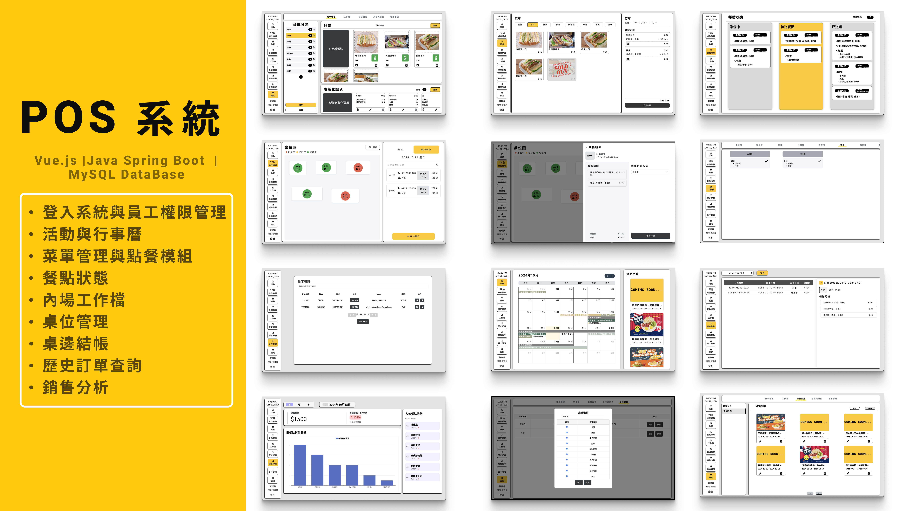
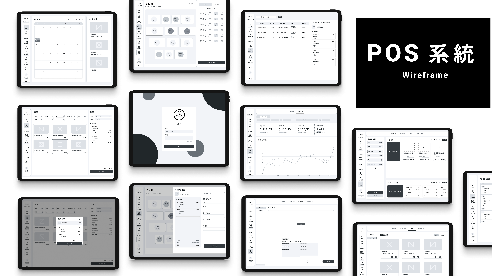

# POS 系統




## 專案簡介
這是一個基於 **Vue.js**、**Java Spring Boot** 和 **MySQL** 開發的 POS 系統，提供餐飲業務所需的全面解決方案。系統涵蓋員工權限管理、菜單與點餐模組、桌位管理、結帳、銷售分析等功能，幫助餐廳高效管理內外場運作。

## 專案結構
### 1. schema.sql 檔案
`schema.sql` 包含了專案所需的資料庫結構，使用 MySQL 作為資料庫，涵蓋`announce`、`authorization`、`categories` 等共 18 張資料表及範例資料，要在本地創建專案資料庫，請完整執行 `schema.sql` 檔案。

### 2. frontend 資料夾
專案的前端使用 **Vue.js** 進行開發，並管理所有依賴。使用 `npm` 安裝依賴並啟動本地伺服器進行開發。

#### frontend 資料夾包含：
-   `src/`：Vue.js 的源代碼，包括元件和頁面
-   `public/`：靜態資源，如圖片
-   `package.json`：前端依賴

#### 安裝與啟動：
1. 進入 `frontend` 資料夾：

    ```bash
    cd frontend
    ```

2. 安裝 npm 依賴：

    ```bash
    npm install
    ```

3. 啟動開發伺服器：
    ```bash
    npm run dev
    ```

### 3. backend 資料夾
專案的後端使用 **Java Spring Boot** 開發，通過 **Gradle** 進行依賴管理。後端負責處理 API 請求、資料庫交互及核心商業邏輯。

#### backend 資料夾包含：
-   `src/`：Java 源代碼，包含控制器、服務和資料庫訪問邏輯
-   `build.gradle`：Gradle 配置檔案，管理依賴和編譯設定

#### 配置與啟動：
1. 進入 `backend` 資料夾：

    ```bash
    cd backend
    ```

2. 使用 Gradle 安裝依賴並刷新項目：

    ```bash
    ./gradlew build
    ./gradlew --refresh-dependencies
    ```

3. 啟動 Spring Boot 應用：
    ```bash
    ./gradlew bootRun
    ```

## 功能模組
### 1. 登入系統與員工權限管理
允許系統管理員創建員工帳號，並基於角色分配不同的操作權限，確保各員工僅能訪問與其職位相關的功能，以此提升系統的安全性和靈活性，能夠根據業務需要動態調整權限設定。

### 2. 活動與行事曆
提供管理行銷活動的功能，商家可以透過此模組創建和編輯行銷活動，同時支援活動圖片上傳。活動會顯示在行事曆中，方便商家查看已安排的活動、行銷時段以及內部的工作計劃。

### 3. 菜單管理與點餐模組
允許管理者輕鬆更新和管理餐廳菜單，包含菜品的上架、下架、價格設定及客製化選項。點餐模組支援餐廳的日常點餐操作，包括顯示當前可用餐點、餐點的客製化選項以及售完標記等。

### 4. 餐點狀態
內外場溝通的核心模組，實時更新每道餐點的狀態（準備中、待送餐點、已送達等），前台和內場員工可以同步查看訂單狀態，確保客戶的點餐能夠高效及時地處理，有效避免內外場信息不對稱的情況。

### 5. 內場工作檯
此模組主要針對餐廳內場的工作流程設計，內場員工可以根據餐點指派的工作流程處理訂單，查看待製作的餐點和已完成的訂單。

### 6. 桌位管理
商家可依自身需求創建桌位及訂位時段，並進行桌位預訂、現場候位等操作，支援手動刷新每張桌子的狀態（用餐中、已訂位、可使用），提供實時追蹤和顯示每個桌位的使用狀況，讓員工對餐廳的桌位狀況有清晰的了解。

### 7. 桌邊結帳
此模組提供無縫的桌邊結帳體驗，支援信用卡（串接綠界科技 API）及現金支付。員工可以直接從 POS 系統發起結帳請求，顯示該桌的帳單明細，並完成交易流程。

### 8. 歷史訂單查詢
允許管理者或員工根據日期查詢過往訂單，詳細的訂單紀錄和歷史查詢功能可以幫助商家進行售後服務，分析訂單數據，並作為營運調整的參考。

### 9. 銷售分析
提供清晰的銷售數據分析，包括每日、每月、每年的銷售額，熱門菜品銷售排名等。通過可視化圖表，管理者可以快速了解營業狀況，並基於分析結果進行戰略調整，幫助餐廳提高盈利能力。

---

以上九大功能模組涵蓋餐廳日常運營管理的核心需求，助力餐廳高效運營。

## 優化與擴展
針對目前系統的優化及擴展方向包含以下四點：

### 1. 會員系統
累積點數與折扣券的功能讓顧客可以在消費過程中獲得回饋，提升消費者的忠誠度。餐廳也可以透過系統發送活動資訊，通知會員最新的優惠活動，促進顧客參與度。

### 2. QR Code 掃描點餐
透過 QR Code 掃描系統，讓顧客自助下單，簡化了點餐流程並減少員工的工作負擔，從而提升點餐效率。

### 3. 外帶系統
提供顧客在線預訂外帶餐點的功能，系統安排取餐並通知顧客餐點完成的時間，進而優化餐廳的外帶服務，可與外送平台整合，提升外帶與外送服務的流暢性。

### 4. 利潤分析
針對餐點的毛利及成本結構分析，幫助管理者深入了解各餐點的營收貢獻，以此優化經營策略。

## 聯絡方式
若對專案有任何問題或建議，歡迎聯絡我：

-   Email: jainesbox@email.com
-   GitHub: [jainexx](https://github.com/jainexx)

---

© 2024 POS 系統. All Rights Reserved.
